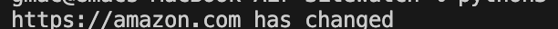

# Sitewatch WIP
POC for code that will take a list of sites and hashes and return if they have changed

Code is a WIP,

## Install
To install the required packeges run 

```
pip install -r requirements.txt 
```

 
 ## Running the code

 Run the script with a domain to add it to the 'watch list' json

```
sitewatch.py domain.com
```

To check the list to see if any sites have changed, run the script with no input

```
sitewatch.py
```
if a site has changed you will see this output. if no changes are detected there will be no output. 



## Future Improvments

* Add functionality to tie in with SOAR or other automation tools
* email functionality to notifiy when somthing changes